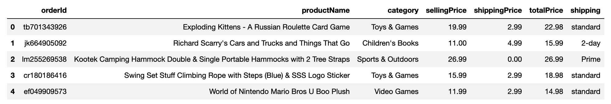

# Transform and Clean Online Orders

In this activity, you'll transform and clean a dataset that consists of online orders.

## Instructions

1. Note that by using the provided starter code, you'll transform and clean the `online_orders.csv` dataset to create the DataFrame that the following image shows:

    

2. To do so, complete the following steps:

    * Create six columns from the single "orderId,productName,category,sellingPrice,shipping,totalPrice" column.

    * Create a new DataFrame with the six columns from the previous step, and then split the row values on the `','` delimiter to populate those six columns.

    * Convert the "sellingPrice" and "totalPrice" columns to a `float` data type.

    * Calculate the shipping price of each product, and then add that price to a new column named "shippingPrice".

    * Reorder the columns to match the final DataFrame, as the following image shows:

      

      In the preceding image, notice that the columns appear in the following order: "orderId", "productName", "category", "sellingPrice", "shippingPrice", "totalPrice", "shipping".

---

© 2022 Trilogy Education Services, LLC, a 2U, Inc. brand.  Confidential and Proprietary.  All Rights Reserved.
